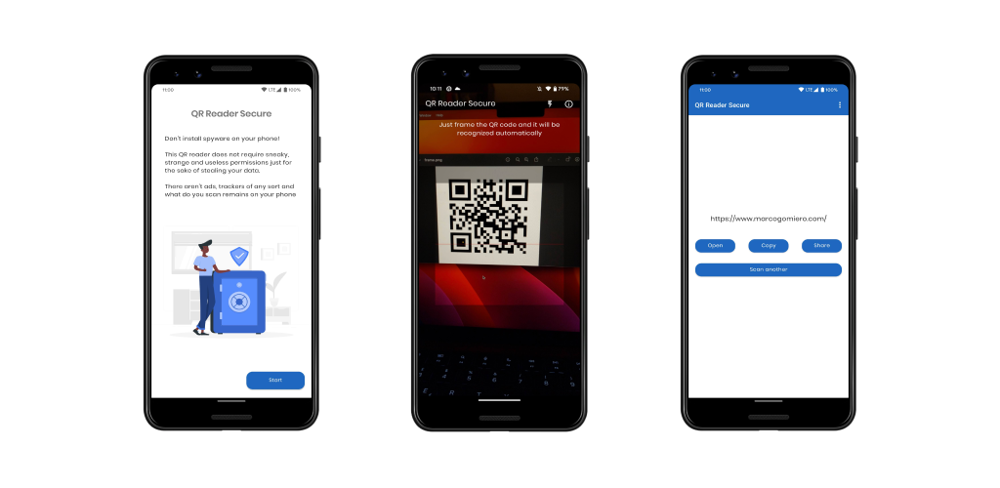

<div align="center">
  
  <h1>QR Reader Secure</h1>
</div>

QR Reader Secure is a simple QR Reader designed and developed with a focus on privacy.

<div align="center">
  
</div>

I decided to develop it after a failed search for a simple and secure reader for my parents.

The app is very simple (the aim is to scan a code and open the link, only this!) and it does not require sneaky, strange and useless permissions just for the sake of stealing your data. There aren't ads, trackers of any sort and what do you scan remains on your phone. The only requested permission is for the camera.

<div align="center">
  
</div>

## Download 📦

You can download QR Reader Secure on the Play Store!

<div align="center"><a href="https://play.google.com/store/apps/details?id=com.prof18.secureqrreader"></a></div>

## Translating 🌍

QR Reader Secure currently supports Italian and English.
If you want to help QR Reader Secure becoming international, I will more than happy.

To add a new translation just add a pull request with a new `strings.xml` file inside a `values-xx` folder (where `xx` is a [two-letter ISO 639-1 language code](https://en.wikipedia.org/wiki/ISO_639-1)).

## Acknowledgments 🌸

- All the vectors and the illustrations used in the app are provided by [freepik.com](https://it.freepik.com/foto-vettori-gratuito/design)
- Thanks to [@giansegato](https://giansegato.com/) and [Fed](https://twitter.com/fedcnvs) for design reviews and many other advices.

## License 📄

```
   Copyright 2020 Marco Gomiero

   Licensed under the Apache License, Version 2.0 (the "License");
   you may not use this file except in compliance with the License.
   You may obtain a copy of the License at

       http://www.apache.org/licenses/LICENSE-2.0

   Unless required by applicable law or agreed to in writing, software
   distributed under the License is distributed on an "AS IS" BASIS,
   WITHOUT WARRANTIES OR CONDITIONS OF ANY KIND, either express or implied.
   See the License for the specific language governing permissions and
   limitations under the License.
```